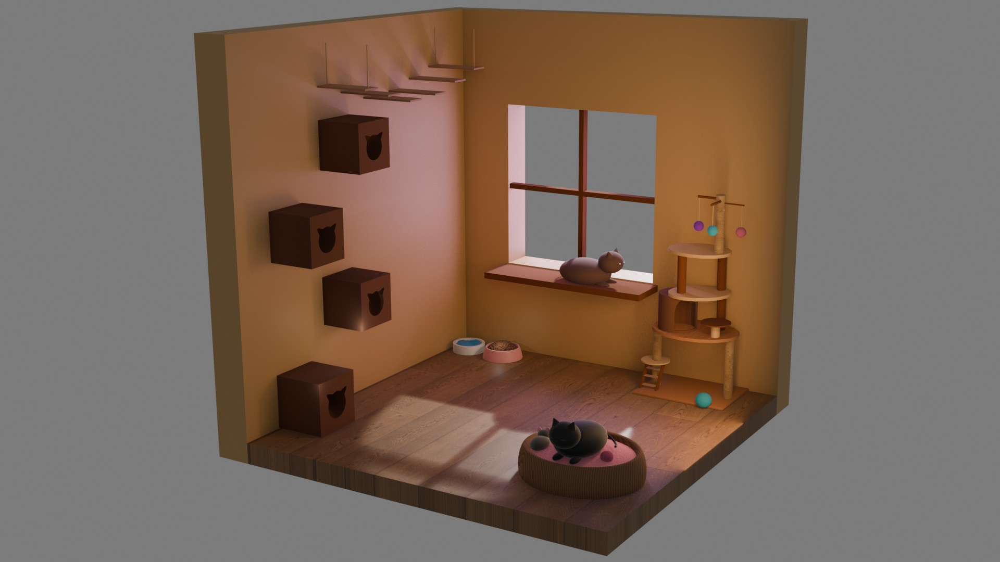
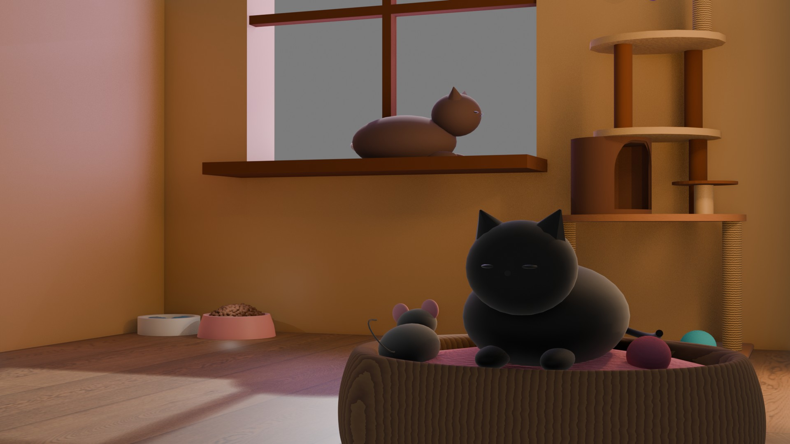
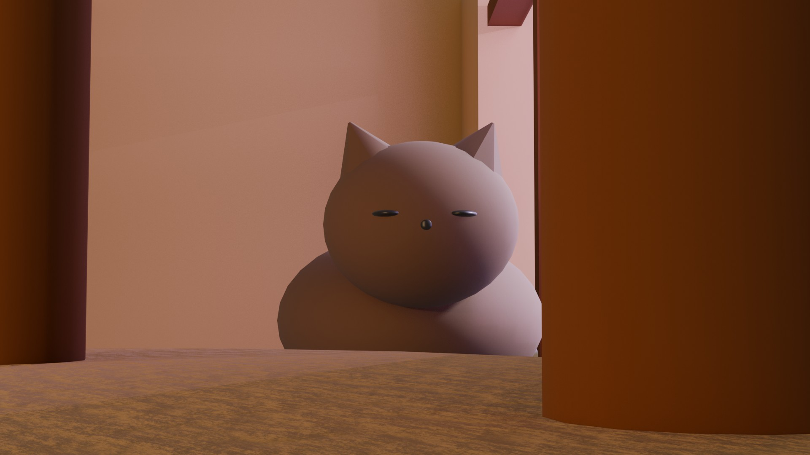

# Diorama — Chambre de chats en 3D

Projet réalisé dans le cadre du cours de Modélisation et Animation 3D — Licence Informatique (L3), Université Lyon 2.  
Modélisation d'un diorama isométrique représentant une chambre dédiée aux chats, entièrement créée sous Blender.

---

## Rendus

| Vue d'ensemble | Vue intérieure |
|:-:|:-:|
|  |  |

| Gros plan |
|:-:|
|  |

---

## Logiciel utilisé

- **Blender** — modélisation, textures, éclairage et rendu (Eevee)

---

## Éléments modélisés

- Deux chats stylisés au design arrondi et kawaii
- Panier/corbeille pour chat
- Fenêtre avec rebord et entrée de lumière naturelle
- Niches murales décoratives
- Arbre à chat multi-niveaux avec jouets suspendus
- Souris jouet et balles colorées
- Gamelles (eau et croquettes)
- Sol en parquet et murs texturés

---

## Choix artistiques

- Style **low-poly arrondi** pour un rendu doux et chaleureux
- Palette de couleurs chaudes (ocre, brun, rose)
- Éclairage naturel simulé via une fenêtre avec jeu d'ombres au sol
- Trois angles de caméra pour mettre en valeur différents aspects de la scène

---

## Auteure

- **Serena** — [@Aid4n4](https://github.com/Aid4n4)  
  Université Lyon 2, 2026
